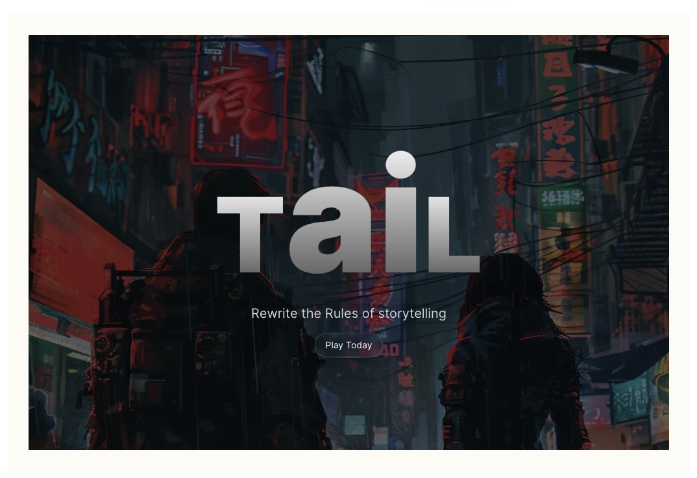
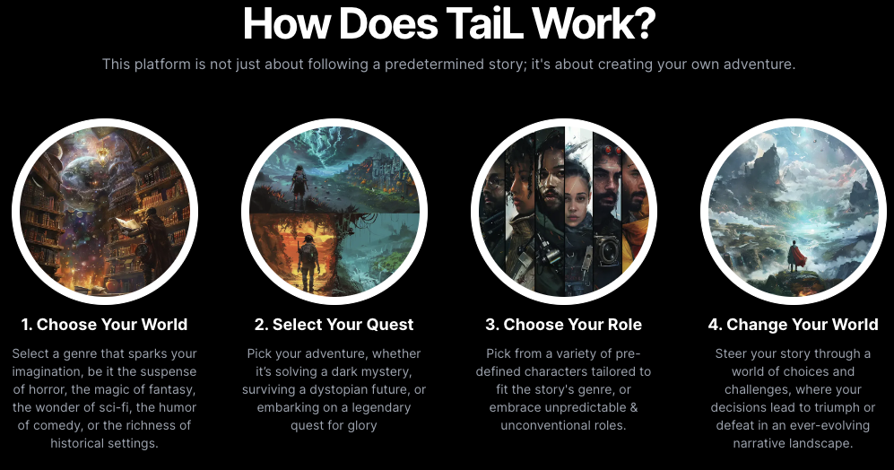

# 🌟 TaiL: Dynamic Storytelling Platform

**Github Repo:** [TaiL Repository](https://github.com/nathansmith-ux/final)

## 📖 Description

TaiL revolutionizes storytelling by removing static barriers, enabling a dynamic adventure crafted by the user. It's a platform where user choice and AI-driven narrative blend seamlessly, creating personalized story experiences. Built with the latest web technologies, TaiL is designed for scalability and immersive engagement, offering a new approach to interactive storytelling.

## 💻 Technologies Used

- **Frontend:** NEXT.js 14, Tailwind CSS, Redux
- **Backend:** Prisma, Sanity (Content Management), Clerk (User Authentication)
- **AI & Integration:** OpenAI API, Vercel AI SDK 3.0, Pusher.io (for live interactions)
- **Payments & Subscriptions:** Stripe
- **Deployment:** Vercel

## 👥 My Contributions

### 💡 Concept to Deployment

- Collaborated from concept through to full application deployment, ensuring the project was scalable and viable for current needs.

### 🧠 AI and Database Integration

- Spearheaded the integration of AI and databases to interpret user profiles, characters, stories, and choices, enabling personalized experiences through generative React components.

### 🎨 Modern Motion Design

- Worked on the design and implementation of modern motion design for a contemporary website using Tailwind CSS and Framer Motion.

### 🔄 Ongoing Enhancements

- Currently enhancing mobile responsiveness and implementing live, multi-user AI interaction via Pusher.io for a seamless cross-device experience.
- Involved in integrating SaaS pricing models to align with the platform's growth and user engagement strategies.

## ✨ Project Highlights

- **Dynamic Storytelling:** TaiL crafts personalized adventures based on the user's chosen character, motivations, and backstory, utilizing a generative user interface for dynamic content creation.
- **Cross-Device Engagement:** Aiming for a seamless experience across devices, with ongoing efforts to enhance mobile responsiveness and live interaction features.
- **Scalable and User-Centric Design:** Built with scalability in mind, focusing on delivering personalized and immersive storytelling experiences.
